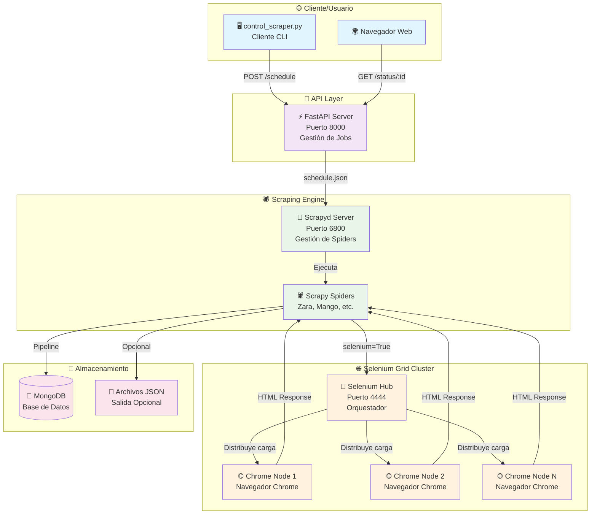

# Stylos Scraper 🕷️👗

**Parte del ecosistema Stylos** - Scraper inteligente para sitios de moda con arquitectura distribuida.

[English](README.md)

<!-- GIF -->


[](https://github.com/erik172/stylos-scrapers)
[](https://python.org)
[](https://scrapy.org)
[](https://docker.com)
[](https://opensource.org/licenses/MIT)

Stylos Scraper es una **solución profesional de web scraping distribuida** diseñada específicamente para la extracción masiva de datos de sitios de e-commerce de moda. Utiliza tecnologías avanzadas como **Selenium Grid**, **Scrapyd**, **FastAPI** y **Docker** para crear un sistema escalable y robusto capaz de manejar múltiples sitios web simultáneamente.

Este proyecto forma parte del ecosistema **Stylos**, una plataforma de inteligencia artificial que analiza tendencias de moda y genera recomendaciones personalizadas basada en diferentes estilos (Old Money, Formal, Streetwear, y muchos más).

<p align="center">
  <a href="#-características-principales">Características Principales</a> •
  <a href="#-inicio-rápido-con-docker">Inicio Rápido</a> •
  <a href="#-uso-básico">Uso</a> •
  <a href="#-contribución">Contribución</a> •
  <a href="#-licencia">Licencia</a> •
  <a href="#-documentación-detallada">Docs Detallados</a>
</p>

---

## ✨ Características Principales

- 🌍 **Soporte Multi-País/Multi-Idioma**: Extracción internacional de Zara con parámetros dinámicos.
- 💱 **Sistema Multi-Moneda Automático**: Detección automática de monedas por país (USD, EUR, COP, etc.).
- 🎯 **Sistema de Extractors Modular**: Arquitectura pluggable para fácil extensión a nuevos retailers.
- 🐳 **Completamente Dockerizado**: Arquitectura Cloud-Native con orquestación automática vía Docker Compose.
- 🚀 **Scraping Distribuido**: Usa Selenium Grid para automatización de navegadores en paralelo.
- 🎮 **Controlador CLI Avanzado**: Una interfaz de línea de comandos para agendar y monitorear trabajos.
- 📊 **Monitoreo con Sentry**: Integración completa para tracking de errores y performance.
- ⚡ **Middlewares Avanzados**: Gestión inteligente de requests y anti-detección mejorada.

## 🚀 Inicio Rápido con Docker

Pon en marcha toda la arquitectura distribuida en minutos.

```bash
# 1. Clonar el repositorio
git clone https://github.com/erik172/stylos-scrapers.git
cd stylos-scrapers

# 2. Crear tu archivo .env
# Puedes copiar el archivo de ejemplo: cp .env.example .env
# O crearlo directamente:
cat > .env << EOF
# Configuración de MongoDB (usa host.docker.internal para conectar desde un contenedor al host)
MONGO_URI=mongodb://host.docker.internal:27017
MONGO_DATABASE=stylos_scrapers
MONGO_COLLECTION=products

# Configuración de Selenium Grid
SELENIUM_MODE=remote
SELENIUM_HUB_URL=http://selenium-hub:4444/wd/hub

# Configuración de Scrapyd
SCRAPYD_URL=http://scrapyd:6800
PROJECT_NAME=stylos

# Monitoreo (Opcional)
SENTRY_DSN=
SCRAPY_ENV=development
EOF

# 3. Lanzar la arquitectura completa
docker-compose up --build -d
```

**Servicios Iniciados:**
- ✅ Servidor FastAPI      → `http://localhost:8000`
- ✅ Servidor Scrapyd      → `http://localhost:6800`
- ✅ Selenium Hub        → `http://localhost:4444`

## 🎮 Uso Básico

Usa el CLI avanzado para controlar y monitorear los trabajos de scraping.

```bash
# Ejecutar un scraping completo para Zara (por defecto Colombia)
python control_scraper.py --spider zara

# Extraer datos de Zara para el mercado de USA en inglés
python control_scraper.py --spider zara --country us --lang en

# Extraer una única URL de producto para testing
python control_scraper.py --spider zara --country us --lang en --url "https://www.zara.com/us/en/tu-producto-url.html"

# Ejecutar un scraping completo para Mango
python control_scraper.py --spider mango
```

El CLI proporciona monitoreo de estado en tiempo real, ID de trabajo y logs detallados.

## 🤝 Contribución

¡Las contribuciones son bienvenidas! Ya sea agregando un nuevo retailer, mejorando la documentación o corrigiendo un bug, tu ayuda es apreciada.

- 📜 Por favor lee nuestro **[Código de Conducta](CODE_OF_CONDUCT.md)**.
- 🛠️ Para detalles sobre cómo contribuir, mira la **[Guía de Contribución](CONTRIBUTING.md)**.

## 📜 Licencia

Este proyecto está bajo la Licencia MIT. Mira el archivo **[LICENSE](LICENSE)** para más detalles.

---

## 📚 Documentación Detallada

<details>
<summary>Haz clic para expandir y ver todos los detalles técnicos, arquitectura y uso avanzado.</summary>

### 🏗️ Arquitectura del Sistema

#### 🌐 Arquitectura Distribuida Completa



### 🔧 Componentes del Sistema

- **API Layer (FastAPI)**: Una interfaz REST en el puerto `8000` para gestionar trabajos de scraping (`/schedule`, `/status`).
- **Scraping Engine (Scrapyd)**: Gestiona y ejecuta los spiders de Scrapy en el puerto `6800`.
- **Selenium Grid Cluster**: Orquesta navegadores Chrome para renderizar JavaScript, con una UI de monitoreo en el puerto `4444`.
- **Extractors Modulares**: Un sistema conectable (patrón `Strategy`) para añadir fácilmente nuevos retailers sin modificar la lógica del spider principal.

### 🛠️ Stack Tecnológico Completo

- **Frameworks**: FastAPI, Scrapy, Scrapyd, Selenium
- **Containerización**: Docker, Docker Compose
- **Base de Datos**: MongoDB (vía PyMongo)
- **Desarrollo**: `bump-my-version` para versionado, `pytest` para testing, `Sentry` para monitoreo.

### 📁 Arquitectura de Archivos

```
stylos-scrapers/
├── 🐳 Docker & Orquestación
│   ├── docker-compose.yml
│   ├── Dockerfile
│   └── scrapy.cfg
├── 🚀 API Layer
│   └── app/
│       ├── api_server.py
│       └── startup.sh
├── 🕷️ Scraping Engine
│   └── stylos/
│       ├── spiders/            # Spiders específicos por retailer (ej. zara.py)
│       ├── extractors/         # Lógica de extracción modular
│       ├── middlewares.py      # Middlewares de Scrapy personalizados
│       ├── pipelines.py        # Pipelines de procesamiento de datos
│       ├── items.py            # Modelos de datos
│       └── settings.py         # Configuración del proyecto
├── 🎮 Control y Gestión
│   └── control_scraper.py      # Cliente CLI
└── ⚙️ Configuración & Docs
    ├── requirements.txt
    ├── README.md
    └── RETAILERS.md
```

### 🎮 Uso Avanzado

#### **🌍 Soporte Multi-País/Idioma para Zara**

Ejecuta scrapers para diferentes mercados de Zara usando argumentos de línea de comandos.

```bash
# Zara España en español
scrapy crawl zara -a country=es -a lang=es

# Zara USA en inglés
scrapy crawl zara -a country=us -a lang=en

# Zara Francia en francés
scrapy crawl zara -a country=fr -a lang=fr
```

- El sistema ajusta automáticamente las URLs, selectores (por cambios de idioma) y moneda.

#### **🐳 Comandos Docker Avanzados**

```bash
# Escalar nodos de Chrome para mayor paralelismo
docker-compose up --scale chrome=3 -d

# Ejecutar un comando dentro de un contenedor
docker-compose exec api python control_scraper.py --spider zara

# Ver logs de servicios específicos
docker-compose logs -f scrapyd
```

### 📊 Estructura de Datos Extraídos

El sistema extrae datos de producto completos, incluyendo precios, descuentos, imágenes por color y metadatos.

<details>
<summary>Haz clic para ver un ejemplo de la salida JSON de un producto.</summary>

```json
{
  "_id": {
    "$oid": "685a4381e6b026683884babc"
  },
  "url": "https://www.zara.com/co/es/pantalon-fluido-pinzas-p00264195.html?v1=440180813&v2=2419737",
  "name": "PANTALON FLUIDO PINZAS",
  "description": "pantalon de tiro medio y cintura con elastico interior. detalle de pinzas en delantero. pierna ancha.",
  "raw_prices": [
    "159.900 COP",
    "89.900 COP"
  ],
  "country": "co",
  "lang": "es",
  "images_by_color": [
    {
      "color": "NEGRO",
      "images": [
        {
          "src": "https://static.zara.net/assets/public/760f/2991/d8c34e28bb62/0b90d2b7a3d7/01165295800-a2/01165295800-a2.jpg?ts=1743077050757&w=710",
          "alt": "PANTALÓN FLUIDO PINZAS - Negro de Zara - Imagen 2",
          "img_type": "product_image"
        }
      ]
    }
  ],
  "site": "ZARA",
  "datetime": "2025-06-24T01:19:45.789676",
  "last_visited": "2025-06-24T01:19:45.789676",
  "original_price": 159900,
  "current_price": 89900,
  "has_discount": true,
  "currency": "COP",
  "discount_amount": 70000,
  "discount_percentage": 44
}
```
</details>

### 📈 Estado del Proyecto y Roadmap

- **Estado Actual**: Versión de producción estable.
- **Implementado**: Zara (multi-país), Mango (Colombia).
- **Roadmap**: Añadir soporte para H&M y Pull & Bear, integrar un sistema de proxy y mejorar el dashboard de monitoreo.

Para una lista detallada de retailers soportados y el pipeline de desarrollo, mira **[RETAILERS.md](RETAILERS.md)**.

</details>

---

**🎯 Desarrollado con ❤️ para el futuro de la moda personalizada.**

> **Arquitectura Cloud-Native**: Un sistema completamente dockerizado y listo para producción con escalamiento horizontal automático y monitoreo avanzado.
