# Stylos Scraper 🕷️👗

**Part of the Stylos ecosystem** - An intelligent, distributed scraper for fashion e-commerce sites.

[Español](README.es.md)

<!-- GIF -->


[](https://github.com/erik172/stylos-scrapers)
[](https://python.org)
[](https://scrapy.org)
[](https://docker.com)
[](https://opensource.org/licenses/MIT)

Stylos Scraper is a **professional, distributed web scraping solution** specifically designed for mass data extraction from fashion e-commerce sites. It uses advanced technologies like **Selenium Grid**, **Scrapyd**, **FastAPI**, and **Docker** to create a scalable and robust system capable of handling multiple websites simultaneously.

This project is part of the **Stylos ecosystem**, an artificial intelligence platform that analyzes fashion trends and generates personalized recommendations based on different styles (Old Money, Formal, Streetwear, and more).

<p align="center">
  <a href="#-key-features">Key Features</a> •
  <a href="#-quick-start-with-docker">Quick Start</a> •
  <a href="#-basic-usage">Usage</a> •
  <a href="#-contributing">Contributing</a> •
  <a href="#-license">License</a> •
  <a href="#-detailed-documentation">Detailed Docs</a>
</p>

---

## ✨ Key Features

- 🌍 **Multi-Country/Multi-Language Support**: International extraction from Zara with dynamic parameters.
- 💱 **Automatic Multi-Currency System**: Auto-detects currencies by country (USD, EUR, COP, etc.).
- 🎯 **Modular Extractor System**: Pluggable architecture for easy extension to new retailers.
- 🐳 **Fully Dockerized**: Cloud-native architecture with automatic orchestration via Docker Compose.
- 🚀 **Distributed Scraping**: Uses Selenium Grid for parallel browser automation.
- 🎮 **Advanced CLI Controller**: A user-friendly command-line interface to schedule and monitor jobs.
- 📊 **Sentry Monitoring**: Full integration for error and performance tracking.
- ⚡ **Advanced Middlewares**: Intelligent request management and enhanced anti-detection.

## 🚀 Quick Start with Docker

Get the entire distributed architecture running in minutes.

```bash
# 1. Clone the repository
git clone https://github.com/erik172/stylos-scrapers.git
cd stylos-scrapers

# 2. Create your .env file
# You can copy the example file: cp .env.example .env
# Or create it directly:
cat > .env << EOF
# MongoDB Configuration (use host.docker.internal to connect from a container to the host)
MONGO_URI=mongodb://host.docker.internal:27017
MONGO_DATABASE=stylos_scrapers
MONGO_COLLECTION=products

# Selenium Grid Configuration
SELENIUM_MODE=remote
SELENIUM_HUB_URL=http://selenium-hub:4444/wd/hub

# Scrapyd Configuration
SCRAPYD_URL=http://scrapyd:6800
PROJECT_NAME=stylos

# Monitoring (Optional)
SENTRY_DSN=
SCRAPY_ENV=development
EOF

# 3. Launch the complete architecture
docker-compose up --build -d
```

**Services Started:**
- ✅ FastAPI Server      → `http://localhost:8000`
- ✅ Scrapyd Server      → `http://localhost:6800`
- ✅ Selenium Hub        → `http://localhost:4444`

## 🎮 Basic Usage

Use the advanced CLI to control and monitor scraping jobs.

```bash
# Run a full scrape for Zara (defaults to Colombia)
python control_scraper.py --spider zara

# Scrape Zara for the US market in English
python control_scraper.py --spider zara --country us --lang en

# Scrape a single product URL for testing
python control_scraper.py --spider zara --country us --lang en --url "https://www.zara.com/us/en/your-product-url.html"

# Run a full scrape for Mango
python control_scraper.py --spider mango
```

The CLI provides real-time status monitoring, job ID tracking, and detailed logs.

## 🤝 Contributing

Contributions are welcome! Whether it's adding a new retailer, improving documentation, or fixing a bug, your help is appreciated.

- 📜 Please read our **[Code of Conduct](CODE_OF_CONDUCT.md)**.
- 🛠️ For details on how to contribute, see the **[Contribution Guide](CONTRIBUTING.md)**.

## 📜 License

This project is licensed under the MIT License. See the **[LICENSE](LICENSE)** file for details.

---

## 📚 Detailed Documentation

<details>
<summary>Click to expand for full technical details, architecture, and advanced usage.</summary>

### 🏗️ System Architecture

#### 🌐 Complete Distributed Architecture

```mermaid
graph TB
    subgraph "🌐 Client/User"
        CLI[🖥️ control_scraper.py<br/>CLI Client]
        WEB[🌍 Web Browser]
    end
    
    subgraph "📡 API Layer"
        API[⚡ FastAPI Server<br/>Port 8000<br/>Job Management]
    end
    
    subgraph "🕷️ Scraping Engine"
        SCRAPYD[🐙 Scrapyd Server<br/>Port 6800<br/>Spider Management]
        SPIDER[🕷️ Scrapy Spiders<br/>Zara, Mango, etc.]
    end
    
    subgraph "🌐 Selenium Grid Cluster"
        HUB[🎯 Selenium Hub<br/>Port 4444<br/>Orchestrator]
        CHROME1[🌐 Chrome Node 1<br/>Chrome Browser]
        CHROME2[🌐 Chrome Node 2<br/>Chrome Browser] 
        CHROME3[🌐 Chrome Node N<br/>Chrome Browser]
    end
    
    subgraph "💾 Storage"
        MONGO[(🍃 MongoDB<br/>Database)]
        FILES[📁 JSON Files<br/>Optional Output]
    end
    
    %% Data Flow
    CLI -->|POST /schedule| API
    WEB -->|GET /status/:id| API
    API -->|schedule.json| SCRAPYD
    SCRAPYD -->|Executes| SPIDER
    SPIDER -->|selenium=True| HUB
    HUB -->|Distributes load| CHROME1
    HUB -->|Distributes load| CHROME2
    HUB -->|Distributes load| CHROME3
    CHROME1 -->|HTML Response| SPIDER
    CHROME2 -->|HTML Response| SPIDER
    CHROME3 -->|HTML Response| SPIDER
    SPIDER -->|Pipeline| MONGO
    SPIDER -->|Optional| FILES
    
    %% Styles
    classDef client fill:#e1f5fe
    classDef api fill:#f3e5f5
    classDef scraping fill:#e8f5e8
    classDef selenium fill:#fff3e0
    classDef storage fill:#fce4ec
    
    class CLI,WEB client
    class API api
    class SCRAPYD,SPIDER scraping
    class HUB,CHROME1,CHROME2,CHROME3 selenium
    class MONGO,FILES storage
```



### 🔧 System Components

- **API Layer (FastAPI)**: A REST interface on port `8000` to manage scraping jobs (`/schedule`, `/status`).
- **Scraping Engine (Scrapyd)**: Manages and runs Scrapy spiders on port `6800`.
- **Selenium Grid Cluster**: Orchestrates headless Chrome browsers for JavaScript rendering, with a monitoring UI on port `4444`.
- **Modular Extractors**: A pluggable system (`Strategy` pattern) to easily add new retailers without modifying the core spider logic.

### 🛠️ Full Tech Stack

- **Frameworks**: FastAPI, Scrapy, Scrapyd, Selenium
- **Containerization**: Docker, Docker Compose
- **Database**: MongoDB (via PyMongo)
- **Development**: `bump-my-version` for versioning, `pytest` for testing, `Sentry` for monitoring.

### 📁 File Architecture

```
stylos-scrapers/
├── 🐳 Docker & Orchestration
│   ├── docker-compose.yml
│   ├── Dockerfile
│   └── scrapy.cfg
├── 🚀 API Layer
│   └── app/
│       ├── api_server.py
│       └── startup.sh
├── 🕷️ Scraping Engine
│   └── stylos/
│       ├── spiders/            # Retailer-specific spiders (e.g., zara.py)
│       ├── extractors/         # Modular data extraction logic
│       ├── middlewares.py      # Custom Scrapy middlewares
│       ├── pipelines.py        # Data processing pipelines
│       ├── items.py            # Data models
│       └── settings.py         # Project settings
├── 🎮 Control & Management
│   └── control_scraper.py      # CLI Client
└── ⚙️ Configuration & Docs
    ├── requirements.txt
    ├── README.md
    └── RETAILERS.md
```

### 🎮 Advanced Usage

#### **🌍 Multi-Country/Language Support for Zara**

Run scrapes for different Zara markets using command-line arguments.

```bash
# Zara Spain in Spanish
scrapy crawl zara -a country=es -a lang=es

# Zara USA in English
scrapy crawl zara -a country=us -a lang=en

# Zara France in French
scrapy crawl zara -a country=fr -a lang=fr
```

- The system automatically adjusts URLs, selectors (for language changes), and currency.

#### **🐳 Advanced Docker Commands**

```bash
# Scale Chrome nodes for more parallelism
docker-compose up --scale chrome=3 -d

# Execute a command inside a container
docker-compose exec api python control_scraper.py --spider zara

# View logs for specific services
docker-compose logs -f scrapyd
```

### 📊 Extracted Data Structure

The system extracts comprehensive product data, including prices, discounts, images by color, and metadata.

<details>
<summary>Click to see a sample JSON output for a product.</summary>

```json
{
  "_id": {
    "$oid": "685a4381e6b026683884babd"
  },
  "url": "https://www.zara.com/us/en/fluid-pleated-pants-p00264195.html?v1=440180813&v2=2419737",
  "name": "FLUID PLEATED PANTS",
  "description": "mid-rise pants with elasticated waistband. front pleats. wide legs.",
  "raw_prices": [
    "$75.90 USD",
    "$45.54 USD"
  ],
  "country": "us",
  "lang": "en",
  "images_by_color": [
    {
      "color": "BLACK",
      "images": [
        {
          "src": "https://static.zara.net/assets/public/760f/2991/d8c34e28bb62/0b90d2b7a3d7/01165295800-a2/01165295800-a2.jpg?ts=1743077050757&w=710",
          "alt": "FLUID PLEATED PANTS - Black from Zara - Image 2",
          "img_type": "product_image"
        }
      ]
    }
  ],
  "site": "ZARA",
  "datetime": "2025-06-24T01:19:45.789676",
  "last_visited": "2025-06-24T01:19:45.789676",
  "original_price": 75.90,
  "current_price": 45.54,
  "has_discount": true,
  "currency": "USD",
  "discount_amount": 30.36,
  "discount_percentage": 40
}
```
</details>

### 📈 Project Status & Roadmap

- **Current Status**: Stable production release.
- **Implemented**: Zara (multi-country), Mango (Colombia).
- **Roadmap**: Add support for H&M and Pull & Bear, integrate a proxy system, and enhance the monitoring dashboard.

For a detailed list of supported retailers and the development pipeline, see **[RETAILERS.md](RETAILERS.md)**.

</details>

---

**🎯 Developed with ❤️ for the future of personalized fashion.**

> **Cloud-Native Architecture**: A fully containerized system ready for production with automatic horizontal scaling and advanced monitoring.