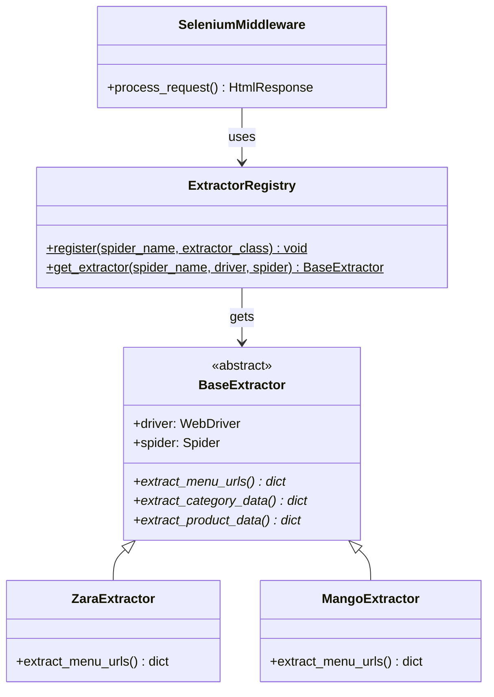

# Stylos Scraper 🕷️👗

**Parte del ecosistema Stylos** - Scraper inteligente para sitios de moda

<!-- GIF -->


## 🎯 Descripción del Proyecto

Stylos Scraper es una solución profesional de web scraping diseñada específicamente para la extracción de datos de sitios de e-commerce de moda. Utiliza tecnologías avanzadas como Selenium y Playwright para navegar sitios web dinámicos y extraer información estructurada de productos, precios e imágenes.

🇨🇴 **Enfoque Inicial:** Comenzamos con el mercado colombiano como piloto
🌍 **Expansión Planificada:** Arquitectura diseñada para escalabilidad internacional

El proyecto forma parte del ecosistema **Stylos**, una plataforma de inteligencia artificial que analiza tendencias de moda y genera recomendaciones personalizadas basadas en diferentes estilos:

- 💼 **Old Money** - Elegancia atemporal
- 🎩 **Formal** - Vestimenta profesional  
- 🛹 **Streetwear** - Moda urbana y casual
- ✨ **Y muchos más estilos personalizables**

## 🚀 Características Principales

### ⚡ Navegación Dinámica Avanzada
- **Automatización completa de menús**: Navegación inteligente por hamburguesas y categorías
- **Scroll infinito**: Manejo automático de lazy loading
- **Pestañas múltiples**: Apertura simultánea de productos para optimizar tiempo
- **Sistema anti-detección**: User agents rotativos y configuración stealth

### 🗄️ Gestión Inteligente de Datos
- **MongoDB integrado**: Almacenamiento con detección automática de cambios
- **Pipeline de normalización**: Procesamiento de precios, imágenes y metadatos
- **Control de duplicados**: Filtrado inteligente de contenido repetido
- **Historial de cambios**: Seguimiento de modificaciones de precios y disponibilidad

### 🔧 Arquitectura Modular
- **Middlewares personalizados**: SeleniumMiddleware y BlocklistMiddleware
- **Items estructurados**: Modelos de datos normalizados con validación
- **Pipelines configurables**: Procesamiento de datos en cadena
- **Utilidades de análisis**: Herramientas para consultar estadísticas y cambios

## 🛠️ Stack Tecnológico

### Frameworks y Librerías Principales
```
Scrapy 2.13.2              # Framework de scraping principal
Selenium 4.33.0            # Automatización de navegador
PyMongo 4.13.1             # Conexión con MongoDB
```

### Dependencias Especializadas
```
fake-useragent 2.2.0       # Rotación de user agents
lxml 5.4.0                 # Procesamiento XML/HTML
unidecode 1.4.0            # Normalización de texto
python-dotenv 1.1.0        # Gestión de variables de entorno
```

**Total**: 59 dependencias optimizadas para web scraping profesional

### Infraestructura
- **Base de Datos**: MongoDB con autenticación
- **Navegadores**: Chrome/Chromium con ChromeDriver
- **Lenguaje**: Python 3.7+
- **Variables de entorno**: Configuración segura con .env

## 📁 Arquitectura del Proyecto

```
stylos-scrapers/
├── stylos/                         # Módulo principal
│   ├── spiders/                    # Spiders de scraping
│   │   ├── zara.py                # Spider completo de Zara (432 líneas)
│   │   ├── mango.py               # Spider básico de Mango
│   │   └── __init__.py
│   ├── middlewares.py             # Middlewares personalizados (201 líneas)
│   ├── pipelines.py               # Pipelines de procesamiento (307 líneas)
│   ├── items.py                   # Modelos de datos (128 líneas)
│   ├── settings.py                # Configuración del proyecto (123 líneas)
│   ├── utils.py                   # Utilidades de análisis (149 líneas)
│   └── __init__.py
├── media/                         # Recursos multimedia
│   └── zara-demo.gif             # Demo del spider en funcionamiento
├── requirements.txt               # 59 dependencias especializadas
├── scrapy.cfg                     # Configuración de despliegue
└── README.md                      # Documentación
```

## 🏪 Retailers Soportados (Colombia 🇨🇴)

### ✅ Completamente Implementado
**Zara Colombia (zara.py)**
- 🌐 **URL:** https://www.zara.com/co/es/
- 🔄 **Navegación completa**: Categorías de Mujer/Hombre con subcategorías
- 🕷️ **432 líneas de código**: Lógica compleja de navegación y extracción
- 🎯 **Extracción avanzada**: Productos, precios en COP, imágenes por color
- 🚀 **Selenium integrado**: ChromeDriver con configuración anti-bot
- 📱 **Scroll infinito**: Carga automática de productos lazy-loaded
- 🖼️ **Imágenes por color**: Extracción organizada por variantes

### 🚧 En Desarrollo
**Mango Colombia (mango.py)**
- 🌐 **URL:** https://shop.mango.com/co/
- 📝 **Estructura base**: Spider básico inicializado
- ⚠️ **Pendiente**: Implementación de lógica de scraping completa

### 📋 Roadmap de Retailers Colombia
```
H&M Colombia       → https://www2.hm.com/es_co/
Pull & Bear CO     → https://www.pullandbear.com/co/  
Bershka Colombia   → https://www.bershka.com/co/
Nike Colombia      → https://www.nike.com/co/
Adidas Colombia    → https://www.adidas.co/
```

## 🌍 Expansión Internacional

### Arquitectura Multi-País
El sistema está construido para expandirse fácilmente a otros mercados:

```python
# Configuración de países (ejemplo)
COUNTRIES = {
    'colombia': {'currency': 'COP', 'domain': '.co', 'lang': 'es_CO'},
    'mexico': {'currency': 'MXN', 'domain': '.mx', 'lang': 'es_MX'},
    'peru': {'currency': 'PEN', 'domain': '.pe', 'lang': 'es_PE'}
}

# Uso: scrapy crawl zara -a country=mexico
```

### Ventajas de la Arquitectura
- ✅ **Reutilización de código**: Los extractors funcionan en cualquier país
- ✅ **Configuración simple**: Solo cambiar URLs y parámetros de moneda
- ✅ **Base de datos escalable**: MongoDB maneja múltiples mercados
- ✅ **Pipelines adaptables**: Procesamiento automático de monedas regionales

### Mercados Objetivo Futuros
1. 🇲🇽 **México** - Mercado grande, mismo idioma
2. 🇵🇪 **Perú** - Región andina, similar a Colombia  
3. 🇨🇱 **Chile** - Mercado desarrollado
4. 🇦🇷 **Argentina** - Gran potencial
5. 🇪🇸 **España** - Mercado europeo hispanohablante

### ¿Por qué empezar con Colombia? 🇨🇴
- **Mercado emergente**: Gran crecimiento en e-commerce
- **Idioma español**: Facilita el desarrollo y testing
- **Retailers globales**: Todos los grandes tienen presencia local
- **Menos competencia**: Menor saturación de herramientas similares
- **Moneda estable**: COP facilita el manejo de precios
- **Zona horaria**: UTC-5 conveniente para desarrollo

## 🚀 Instalación y Configuración

### Prerrequisitos del Sistema

#### Para Docker Hub (Recomendado)
- **Docker** y **Docker Compose** instalados
- **MongoDB** (local o remoto)
- **Git** para clonación del repositorio

#### Para Modo Local
- **Python 3.7+** (recomendado 3.9+)
- **Chrome/Chromium Browser** instalado
- **MongoDB** (local o remoto)
- **Git** para clonación del repositorio

### 🐳 Instalación con Docker Hub (Recomendado)

1. **Clonar el repositorio**
   ```bash
   git clone <url-del-repositorio>
   cd stylos-scrapers
   ```

2. **Configurar variables de entorno**
   ```bash
   # Crear archivo .env con configuración para Docker
   cp .env.example .env  # Si existe archivo de ejemplo
   # O crear manualmente:
   cat > .env << EOF
   MONGO_URI=mongodb://host.docker.internal:27017
   MONGO_DATABASE=stylos_scrapers
   MONGO_COLLECTION=products
   SELENIUM_MODE=remote
   SELENIUM_HUB_URL=http://selenium-hub:4444
   EOF
   ```

3. **Ejecutar con Docker**
   ```bash
   # Construir y iniciar todos los servicios
   docker-compose up --build
   ```

### 💻 Instalación Local (Desarrollo)

1. **Clonar el repositorio**
   ```bash
   git clone <url-del-repositorio>
   cd stylos-scrapers
   ```

2. **Crear y activar entorno virtual**
   ```bash
   python -m venv venv
   source venv/bin/activate  # Linux/Mac
   # o
   venv\Scripts\activate     # Windows
   ```

3. **Instalar todas las dependencias**
   ```bash
   pip install -r requirements.txt
   ```

4. **Configurar variables de entorno para modo local**
   ```bash
   # Crear archivo .env en la raíz del proyecto
   MONGO_URI=mongodb://localhost:27017
   MONGO_DATABASE=stylos_scrapers
   MONGO_COLLECTION=products
   MONGO_USERNAME=tu_usuario
   MONGO_PASSWORD=tu_password
   
   # Configuración de Selenium para modo LOCAL
   SELENIUM_MODE=local                           # 'local' para Chrome local
   # SELENIUM_HUB_URL no es necesaria en modo local
   ```

### 🌍 Configuración Multi-País
Para cambiar de país, simplemente modifica las URLs en los spiders:

```python
# En stylos/spiders/zara.py
start_urls = [
    "https://www.zara.com/co/",    # Colombia (actual)
    # "https://www.zara.com/mx/",  # México
    # "https://www.zara.com/pe/",  # Perú
]
```

**Ejecutar en diferentes países:**
```bash
# Colombia (configuración actual)
scrapy crawl zara

# Para cambiar a otro país, editar las URLs en el spider
# y ejecutar normalmente - todo el resto funciona igual
```

## 🎮 Uso y Ejecución

### 🐳 Ejecutar con Docker Hub (Modo Recomendado)

El proyecto incluye un sistema completo con Selenium Grid para mayor escalabilidad y robustez:

```bash
# 1. Construir y ejecutar todos los servicios (Scraper + Selenium Hub + Chrome)
docker-compose up --build

# 2. Ejecutar en segundo plano
docker-compose up -d --build

# 3. Ver logs en tiempo real
docker-compose logs -f scraper

# 4. Detener todos los servicios
docker-compose down

# 5. Ver interfaz web del Hub (opcional)
# Visita: http://localhost:4444
```

#### Arquitectura del Hub Docker
```
┌─────────────────┐    ┌─────────────────┐    ┌─────────────────┐
│   Scraper       │───▶│  Selenium Hub   │───▶│   Chrome Node   │
│   (Scrapy)      │    │   (Grid)        │    │   (Browser)     │
└─────────────────┘    └─────────────────┘    └─────────────────┘
```

### 💻 Ejecutar sin Hub (Modo Local)

Para desarrollo o testing rápido, puedes ejecutar sin Docker:

```bash
# 1. Configurar variables de entorno para modo local
echo "SELENIUM_MODE=local" >> .env

# 2. Ejecutar spider normalmente
scrapy crawl zara

# 3. Para modo específico de spider
scrapy crawl zara -a url="https://www.zara.com/co/es/producto..."
```

### 📋 Comandos Específicos por Modo

#### Con Docker Hub
```bash
# Ejecutar spider específico
docker-compose run scraper scrapy crawl mango

# Guardar resultados
docker-compose run scraper scrapy crawl zara -o /app/productos_zara.json

# Configuración personalizada
docker-compose run scraper scrapy crawl zara -s DOWNLOAD_DELAY=5
```

#### Sin Hub (Local)
```bash
# Ejecutar spider de Zara (completamente funcional)
scrapy crawl zara

# Ejecutar spider de Mango (en desarrollo)
scrapy crawl mango

# Guardar resultados en archivo JSON
scrapy crawl zara -o productos_zara.json

# Ejecutar con configuración personalizada
scrapy crawl zara -s DOWNLOAD_DELAY=3
scrapy crawl zara -s USER_AGENT='custom-agent'
```

### Análisis de Datos
```bash
# Ejecutar utilidades de análisis
python stylos/utils.py

# Ver estadísticas de productos
python -c "from stylos.utils import print_statistics; print_statistics()"
```

### Configuración Avanzada
```bash
# Habilitar logs detallados
scrapy crawl zara -L DEBUG

# Usar configuración personalizada
scrapy crawl zara -s ROBOTSTXT_OBEY=True

# Configurar concurrencia
scrapy crawl zara -s CONCURRENT_REQUESTS=8
```

## 📊 Estructura de Datos Extraídos

### Información del Producto
```json
{
  "url": "https://www.zara.com/co/es/producto...",
  "name": "BLAZER OVERSIZE LINO",
  "description": "blazer oversize confeccionado en lino...",
  "original_price": "399.000 COP",
  "current_price": "299.000 COP",
  "original_price_amount": 399000.0,
  "current_price_amount": 299000.0,
  "currency": "COP",
  "discount_percentage": 25,
  "has_discount": true
}
```

### Imágenes por Color
```json
{
  "images_by_color": [
    {
      "color": "NEGRO",
      "images": [
        {
          "src": "https://static.zara.net/photos/...",
          "alt": "BLAZER OVERSIZE LINO",
          "img_type": "principal"
        }
      ]
    }
  ]
}
```

### Metadatos del Sistema
```json
{
  "site": "zara",
  "datetime": "2024-01-15T14:30:00",
  "last_visited": "2024-01-15T14:30:00"
}
```

## 🔧 Configuración del Sistema

### Middlewares Activos
- **SeleniumMiddleware**: Navegación dinámica con Chrome
- **BlocklistMiddleware**: Filtrado de URLs no deseadas

### Pipelines Configurados
1. **DuplicatesPipeline** (200): Filtrado de duplicados
2. **StylosPipeline** (300): Procesamiento general  
3. **MongoDBPipeline** (400): Almacenamiento en base de datos

## 🚀 Modos de Ejecución: Hub vs Local

### 🐳 Docker Hub (Recomendado para Producción)

#### ✅ Ventajas
- **Escalabilidad**: Múltiples instancias de Chrome ejecutándose simultáneamente
- **Estabilidad**: Navegadores aislados, menor impacto de crashes
- **Reproducibilidad**: Mismo entorno en desarrollo y producción
- **Gestión automática**: Docker maneja la instalación y configuración de Chrome
- **Recursos**: Mejor uso de memoria y CPU
- **Interfaz web**: Monitor del hub en http://localhost:4444

#### ⚠️ Consideraciones
- Requiere Docker y Docker Compose instalados
- Mayor uso de recursos del sistema inicialmente

#### 🎯 Cuándo usar
- ✅ Scraping de producción con grandes volúmenes
- ✅ Equipos de desarrollo (entorno consistente)
- ✅ Sistemas de CI/CD
- ✅ Servidores sin interfaz gráfica

### 💻 Modo Local (Ideal para Desarrollo)

#### ✅ Ventajas
- **Rapidez**: Inicio inmediato sin Docker
- **Debugging**: Puedes ver el navegador funcionando (modo no-headless)
- **Simplicidad**: No requiere Docker
- **Desarrollo**: Ideal para testing y desarrollo de extractors

#### ⚠️ Consideraciones
- Requiere Chrome/Chromium instalado localmente
- Una sola instancia de navegador a la vez
- Puede ser menos estable con múltiples ejecuciones

#### 🎯 Cuándo usar
- ✅ Desarrollo y testing de nuevos extractors
- ✅ Debugging de selectores CSS/XPath
- ✅ Pruebas rápidas con un solo producto
- ✅ Desarrollo en máquinas locales

## 🔄 Cambiar entre Modos

### Cambiar a Docker Hub
```bash
# 1. Actualizar .env
echo "SELENIUM_MODE=remote" >> .env
echo "SELENIUM_HUB_URL=http://selenium-hub:4444" >> .env

# 2. Ejecutar con Docker
docker-compose up --build
```

### Cambiar a Local
```bash
# 1. Actualizar .env
echo "SELENIUM_MODE=local" >> .env

# 2. Ejecutar normalmente
scrapy crawl zara
```

### Variables de Entorno Soportadas

#### Configuración General
```bash
MONGO_URI=mongodb://localhost:27017
MONGO_DATABASE=stylos_scrapers
MONGO_COLLECTION=products
MONGO_USERNAME=usuario
MONGO_PASSWORD=contraseña
DEFAULT_COUNTRY=colombia
```

#### Configuración Selenium
```bash
# Para Docker Hub
SELENIUM_MODE=remote
SELENIUM_HUB_URL=http://selenium-hub:4444

# Para Local
SELENIUM_MODE=local
# SELENIUM_HUB_URL no requerida
```

## 📊 Comparación de Modos

| Característica | Docker Hub 🐳 | Local 💻 |
|----------------|---------------|----------|
| **Instalación** | Docker requerido | Python + Chrome |
| **Tiempo inicio** | ~30s (primera vez) | ~5s |
| **Escalabilidad** | Múltiples Chrome | Una instancia |
| **Debugging** | Logs en terminal | Browser visible |
| **Recursos** | Mayor memoria inicial | Menor overhead |
| **Estabilidad** | Alta (aislamiento) | Media |
| **Producción** | ✅ Recomendado | ❌ No recomendado |
| **Desarrollo** | ✅ Bueno | ✅ Excelente |
| **CI/CD** | ✅ Perfecto | ❌ Limitado |

## 🛠️ Archivos de Configuración

### docker-compose.yml
```yaml
version: '3.8'

services:
  scraper:
    build: .
    command: scrapy crawl zara
    env_file:
      - ./.env
    volumes:
      - ./stylos:/app/stylos
    depends_on:
      - selenium-hub
      - chrome

  selenium-hub:
    image: selenium/hub:4.22.0
    ports:
      - "4444:4444"

  chrome:
    image: selenium/node-chrome:4.22.0
    shm_size: '2g'
    depends_on:
      - selenium-hub
    environment:
      - SE_EVENT_BUS_HOST=selenium-hub
      - SE_EVENT_BUS_PUBLISH_PORT=4442
      - SE_EVENT_BUS_SUBSCRIBE_PORT=4443
      - NODE_MAX_SESSIONS=5
      - NODE_MAX_INSTANCES=5
```

### Dockerfile
```docker
FROM python:3.11-slim

WORKDIR /app

ENV PYTHONDONTWRITEBYTECODE 1
ENV PYTHONUNBUFFERED 1

COPY requirements.txt .
RUN pip install --no-cache-dir -r requirements.txt

COPY ./stylos /app/stylos
```

## 📈 Estado del Proyecto

**🟢 En Producción** - Sistema estable y funcional con arquitectura de hub

### ✅ Funcionalidades Implementadas
- [x] Sistema dual: Docker Hub + Modo Local
- [x] Spider completo de Zara con navegación dinámica  
- [x] Selenium Grid con escalabilidad automática
- [x] Sistema de middlewares personalizados
- [x] Pipeline de datos con MongoDB
- [x] Normalización de precios y texto
- [x] Extracción de imágenes por variantes de color
- [x] Sistema anti-detección con rotación de user agents
- [x] Detección automática de cambios de precios
- [x] Interfaz web para monitoreo del hub (puerto 4444)

### 🚧 En Desarrollo
- [ ] Spider completo de Mango
- [ ] Optimización de recursos Docker
- [ ] Dashboard de monitoreo avanzado

**Última actualización:** Diciembre 2024

## 📈 Estado del Proyecto

**🟢 En Producción** - Sistema estable y funcional

### ✅ Funcionalidades Implementadas
- [x] Spider completo de Zara con navegación dinámica
- [x] Sistema de middlewares personalizados
- [x] Pipeline de datos con MongoDB
- [x] Normalización de precios y texto
- [x] Extracción de imágenes por variantes de color
- [x] Sistema anti-detección con rotación de user agents
- [x] Detección automática de cambios de precios
- [x] Utilidades de análisis y estadísticas

### 🔄 En Desarrollo
- [ ] Spider completo de Mango
- [ ] Integración completa con Selenium
- [ ] Dashboard web para monitoreo
- [ ] API REST para acceso a datos

### 🎯 Próximas Funcionalidades
- [ ] Spiders para H&M, Uniqlo, Pull & Bear
- [ ] Sistema de alertas de cambios de precio
- [ ] Análisis de tendencias con IA
- [ ] Exportación a múltiples formatos

## 🏗️ Arquitectura Técnica: Sistema de Extractors

### 🎯 Problema Resuelto

El desafío principal era que cada sitio web tiene **selectores y lógica de navegación completamente diferentes**. Un middleware hardcodeado para Zara no funcionaría para Mango, H&M, etc.

**Solución**: **Patrón Strategy** con extractors especializados por sitio web.

### 🧠 Concepto del Sistema

Cada sitio web tiene su propio "extractor" especializado que implementa la misma interfaz pero con lógica específica. El middleware se vuelve genérico y solo delega la extracción al extractor correcto.

```mermaid
graph TD
    A["🕷️ Spider Solicita Extracción"] --> B["⚙️ SeleniumMiddleware"]
    B --> C["📋 ExtractorRegistry"]
    C --> D{"🤔 ¿Qué spider?"}
    D -->|"name = 'zara'"| E["🟦 ZaraExtractor"]
    D -->|"name = 'mango'"| F["🟧 MangoExtractor"]
    D -->|"name = 'hm'"| G["🟩 HMExtractor"]
    E --> H["🔧 Lógica específica de Zara<br/>• Menú hamburguesa<br/>• Categorías MUJER/HOMBRE<br/>• Selectores específicos"]
    F --> I["🔧 Lógica específica de Mango<br/>• Menú directo<br/>• Botones load-more<br/>• Swatches de color"]
    G --> J["🔧 Lógica específica de H&M<br/>• API endpoints<br/>• Paginación<br/>• Selectores únicos"]
    H --> K["📦 Datos Estructurados"]
    I --> K
    J --> K
    K --> L["🎯 Spider Recibe Datos<br/>{'extracted_urls': [...]}"]
```



### 🔧 Componentes del Sistema

#### **1. Extractor Base Abstracto**
```python
# stylos/extractors/__init__.py
class BaseExtractor(ABC):
    """Define la interfaz común para todos los extractors"""
    
    @abstractmethod
    def extract_menu_urls(self): pass
    
    @abstractmethod  
    def extract_product_data(self): pass
```

#### **2. Registry con Auto-registro**
```python
# Usando un decorador, cada extractor se registra automáticamente
@register_extractor('zara')
class ZaraExtractor(BaseExtractor):
    # Lógica de Zara
    pass

@register_extractor('mango')
class MangoExtractor(BaseExtractor):
    # Lógica de Mango
    pass
```

#### **3. Middleware Genérico**
```python
# El middleware ahora es agnóstico del sitio
def process_request(self, request, spider):
    # Delega la extracción al extractor correcto
    extractor = ExtractorRegistry.get_extractor(spider.name, self.driver, spider)
    extracted_data = extractor.extract_menu_urls()
```

### 🔄 Flujo de Ejecución Completo

```mermaid
sequenceDiagram
    participant S as Spider
    participant M as SeleniumMiddleware
    participant R as ExtractorRegistry
    participant Z as ZaraExtractor
    participant D as WebDriver

    S->>M: Request con extraction_type='menu'
    M->>R: get_extractor('zara', driver, spider)
    R->>Z: Crear ZaraExtractor(driver, spider)
    Z-->>R: Instancia de ZaraExtractor
    R-->>M: ZaraExtractor instance
    M->>Z: extract_menu_urls()
    Z->>D: Ejecutar lógica específica de Zara
    D-->>Z: HTML renderizado + interacciones
    Z-->>M: {'extracted_urls': [...]}
    M-->>S: Response con datos estructurados
```



### 🎮 Ejemplo Práctico: Diferencias por Sitio

#### **Zara vs Mango - Mismo resultado, lógica diferente:**

```python
# 🔴 ZARA: Menú hamburguesa complejo
@register_extractor('zara')
class ZaraExtractor(BaseExtractor):
    def extract_menu_urls(self):
        # 1. Buscar botón hamburguesa con múltiples selectores
        # 2. Navegar por categorías MUJER/HOMBRE

# 🟠 MANGO: Menú directo diferente  
@register_extractor('mango')
class MangoExtractor(BaseExtractor):
    def extract_menu_urls(self):
        # 1. Buscar botón de menú (selectores diferentes)
        # 2. Extraer enlaces directamente (estructura diferente)
```

### 🏗️ Arquitectura del Sistema de Extractors



### 🚀 Ventajas del Sistema

- **📈 Escalabilidad Extrema**: Agregar un nuevo sitio es tan simple como crear un nuevo archivo de extractor.
- **🧪 Testing Individual**: Cada extractor se puede probar de forma aislada.
- **🔧 Mantenimiento Aislado**: Los cambios en un sitio no afectan a otros.
- **🛡️ Robustez**: El sistema es predecible y tiene un fallback si no encuentra un extractor.

---

**Desarrollado con ❤️ para el futuro de la moda personalizada**

> **Nota**: Este es un proyecto en desarrollo activo con sistema dual Docker Hub + Local. La documentación y funcionalidades pueden cambiar frecuentemente. 